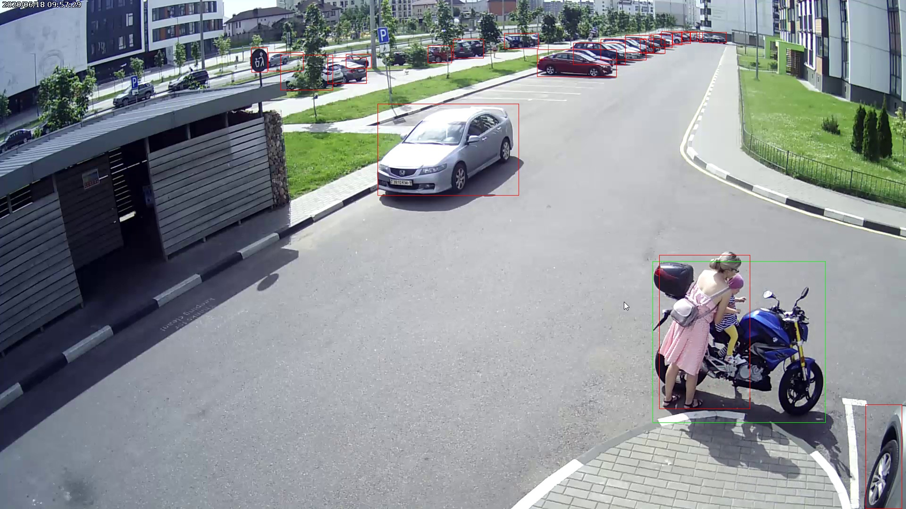

# Moto Alarm

Every motorcycle owner gets a bit nervous when people touch their toy without asking their permission. This tool is detecting if other objects such as cars and people overlaps with the bounding box of motorcycles and notifies the owner by beeping (Windows only) and storing the image. The tool is built using Mask R-CNN for Object Detection and Segmentation, COCO model and OpenCV.

Limitations:
* The algorithm detects all the motorcycles on the video frame. To recognize a specific motorcyle only need to train the custom model.
* This tool is very slow. It takes about 5 seconds to process a single frame on a regular laptop (Intel Core i5).

Steps to run:
* Clone this repository
* Clone repository https://github.com/tomgross/Mask_RCNN
* Checkout the branch **tensorflow-2.0** of Mask_RCNN repository
* Run `python setup.py install` in Mask_RCNN repository
* Run `pip install -r requirements.txt` in the root of this repository
* Finally run `python moto_alarm.py` in the root of this repository

# Sample

